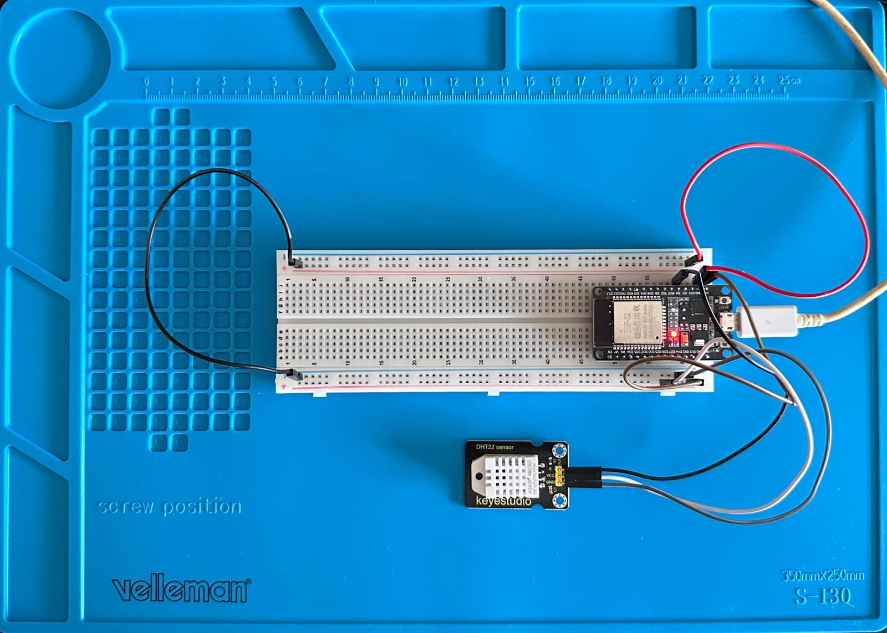
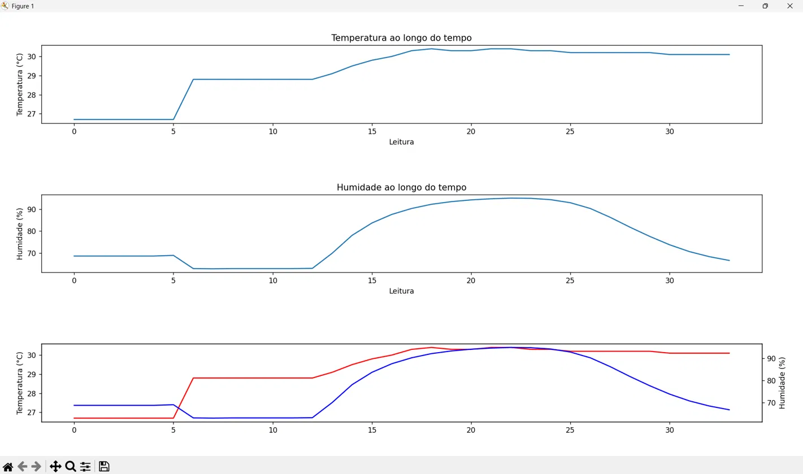

# esp32-temperature-hummidity

Estação meteorológica com ESP32 e DHT22 — leitura de temperatura/humidade, logging em CSV, e evolução para stack MQTT + InfluxDB + Grafana

## Objetivo

Este projeto nasceu como uma forma de me familiarizar com microcontroladores, sensores e diferentes linguagens de programação (C++ para o firmware, Python para o processamento de dados), através de um caso prático: construir uma estação meteorológica simples do zero.

O objetivo inicial, documentado nesta primeira fase do projeto, foi:

1. Ler os dados de temperatura e humidade de um sensor DHT22 através de um microcontrolador ESP32, e mostrá-los no monitor série.
2. Capturar esses dados através de um script Python (via porta série) e guardá-los de forma persistente num ficheiro CSV.
3. A partir desses dados, gerar gráficos de temperatura e humidade em função do tempo de registo.

## Componentes utilizados

- **ESP32** (NodeMCU-32S)
- **Sensor DHT22** (temperatura e humidade)
- Breadboard e fios de ligação

## Estrutura do repositório

- `Temperature and Hummidity Station/` — projeto PlatformIO (firmware C++ do ESP32)
- `Dashboard-scripts/ler_sensor.py` — script que lê a porta série e grava os dados em CSV
- `Dashboard-scripts/visualizar_dados.py` — script que lê o CSV e gera os gráficos
- `sensor_data.csv` — dados recolhidos durante os testes

## Como correr

1. Abrir o projeto `Temperature and Hummidity Station/` no VSCode com a extensão PlatformIO.
2. Criar um ficheiro `include/secrets.h` (não incluído no repositório por segurança) com:
```cpp
   #define WIFI_SSID "o_teu_ssid"
   #define WIFI_PASSWORD "a_tua_password"
```
3. Fazer upload do firmware para o ESP32.
4. Correr `ler_sensor.py` (ajustando a porta série, ex. `COM4`) para começar a gravar os dados.
5. Correr `visualizar_dados.py` para gerar os gráficos a partir dos dados recolhidos.

## Setup físico



## Resultados



Os gráficos mostram a evolução da temperatura e da humidade ao longo das leituras recolhidas, incluindo uma visualização combinada com eixo Y duplo, que permite comparar as duas variáveis apesar das escalas diferentes.

## Conclusão

Esta primeira fase permitiu consolidar a leitura de sensores com microcontroladores, a comunicação série entre o ESP32 e um script Python, e o processamento/visualização de dados com bibliotecas padrão do Python. Serviu também de base para perceber os desafios práticos de sistemas embutidos — desde erros de codificação de bytes na porta série até à gestão de credenciais sensíveis num repositório público.

**Próximos passos:** evoluir esta arquitetura para uma stack sem fios e mais escalável, com o ESP32 a publicar os dados via WiFi para um broker MQTT (Mosquitto), armazenamento numa base de dados de séries temporais (InfluxDB), e visualização num dashboard em tempo real (Grafana).

## Nota sobre o uso de IA

O código deste projeto foi escrito por mim. O Claude (Anthropic) foi utilizado como apoio na estruturação do raciocínio e na identificação de erros — a lógica e a implementação final resultam do meu próprio trabalho, orientado por explicações sobre bibliotecas padrão do Python e do ecossistema Arduino/ESP32.
